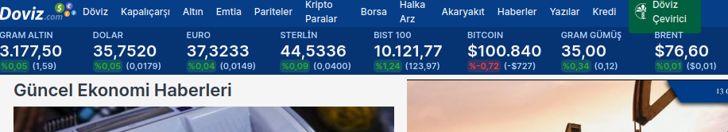

# currency-scrape
Scraping main currency/assets from www.doviz.com website simply..

# Usage 

>install jq for better json output ...


```sh
go run main.go |jq

```
**Output** 
```json
{
  "Gold": "3.175,97",
  "Dolar": "35,7478",
  "Euro": "37,3091",
  "Sterlin": "44,5171",
  "Bist100": "10.121,77",
  "Bitcoin": "$100.891",
  "Silver": "35,02",
  "Brent": "$76,56"
}
```
